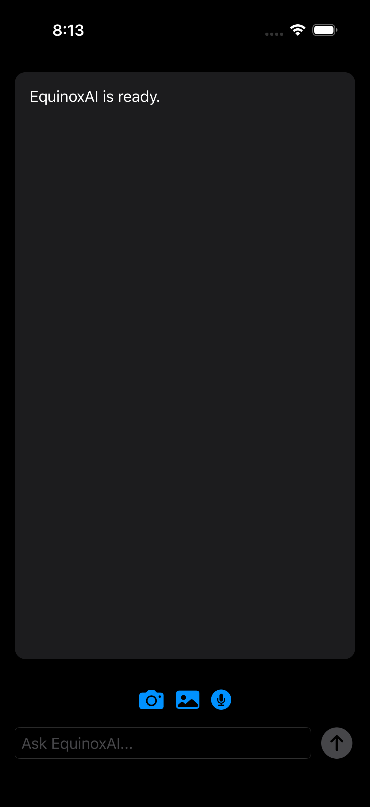
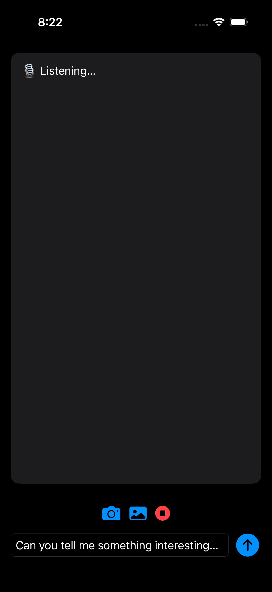
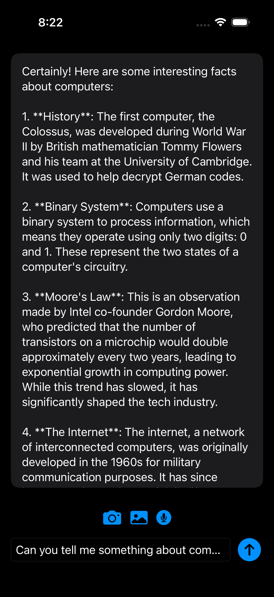
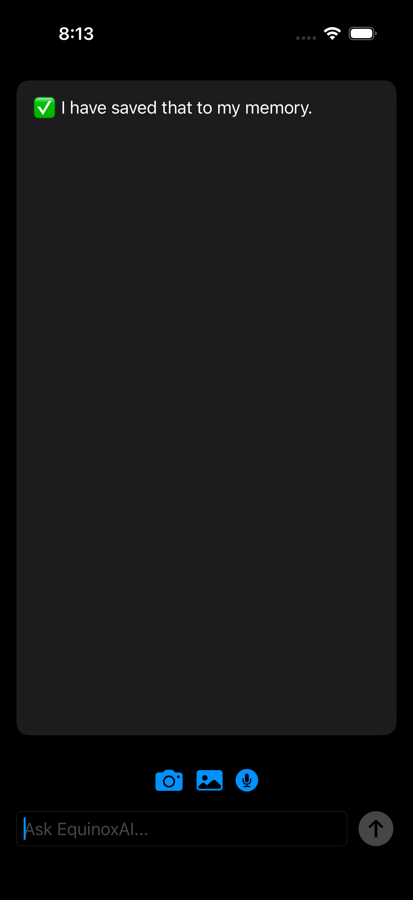
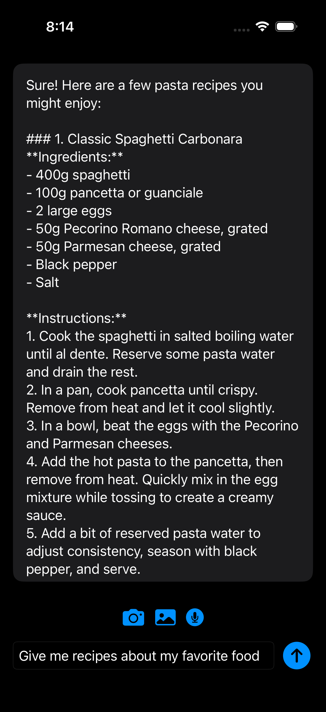

# 🌗 Equinox AI --- On-Device Multimodal Intelligence

Equinox AI is an **on-device, privacy-first multimodal assistant** built
using **Apple Foundation Models**, **Vision**, **Speech**, and
**SwiftUI**.\
It seamlessly combines **text**, **voice**, and **camera/image inputs**
to create a fast, intelligent, and fully local AI experience --- no
cloud, no servers, no data leakage.

> ⚡️ All inference runs **entirely on-device** using Apple
> Intelligence--powered Foundation Models.

------------------------------------------------------------------------

## ✨ Features

### 🧠 On-Device LLM Chat

-   Powered by `FoundationModels`
-   Low-latency responses
-   Works offline (once models are ready)
-   No network calls, no cloud inference

### 🎙️ Voice Input (Speech → Text → LLM)

-   Live speech recognition
-   Tap-to-record interaction
-   Auto-transfers spoken queries into the chat prompt
-   Natural conversational flow

### 📷 Image & Camera Intelligence

-   Capture images directly from the camera
-   OCR using Vision framework
-   Converts visual content into text for LLM reasoning
-   Fully local Vision + ML pipeline

### 🔐 Privacy First by Design

-   No external APIs
-   No image uploads
-   No voice data stored remotely
-   Built entirely on Apple's on-device ML stack

------------------------------------------------------------------------

## 🖼️ App Preview

### Home Screen

### Voice Input Demo

### Voice Recognition Result

### Memory / Context Awareness

### Favorite Recipe Example

------------------------------------------------------------------------

## 🧩 Architecture Overview

    User Input
     ├── Text (SwiftUI)
     ├── Voice (Speech Framework)
     └── Image (Camera + Vision)
              ↓
         Multimodal Prompt Builder
              ↓
      Apple Foundation Language Model
              ↓
            Response

------------------------------------------------------------------------

## 🛠️ Tech Stack

-   SwiftUI
-   FoundationModels
-   Vision
-   Speech
-   UIKit
-   Swift Concurrency (async/await)

------------------------------------------------------------------------

## 🚀 Getting Started

### Requirements

-   iOS device that supports **Apple Intelligence**
-   iOS 18+
-   Xcode 16+
-   **Physical device required**

### Run the App

1.  Clone the repo
2.  Open in Xcode
3.  Select a real device
4.  Build & run

------------------------------------------------------------------------

## 🔮 Future Enhancements

-   Multimodal memory
-   Visual question answering
-   Scene understanding
-   Persistent on-device knowledge

------------------------------------------------------------------------

## 👤 Author

**Shreyas Battula**\
MS Computer Science @ UCR\
AI / ML / On-Device Intelligence
